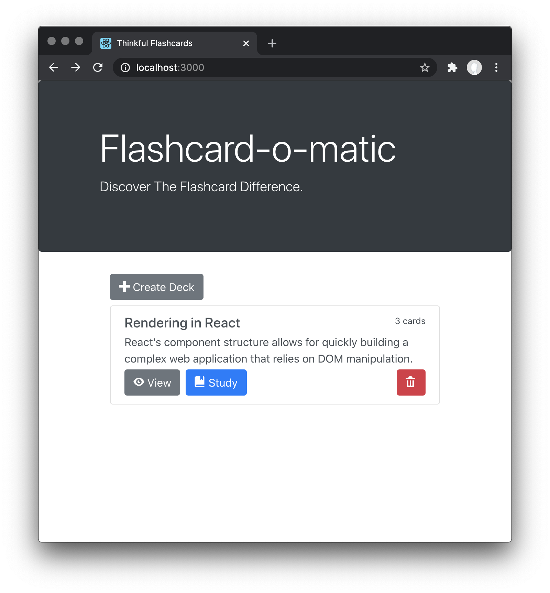
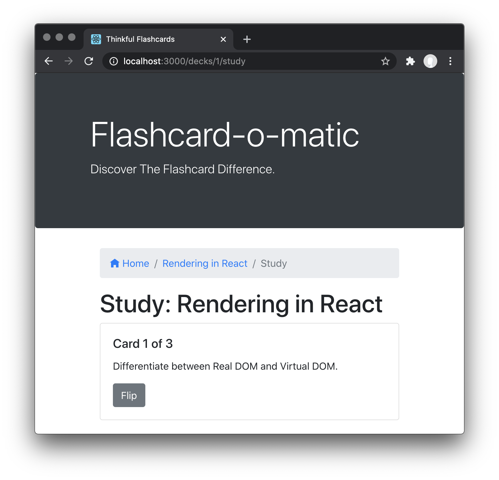
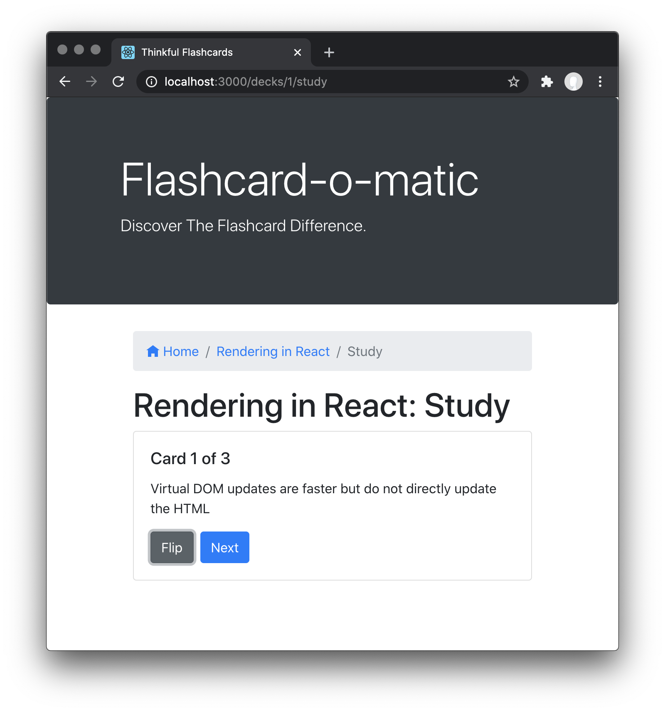
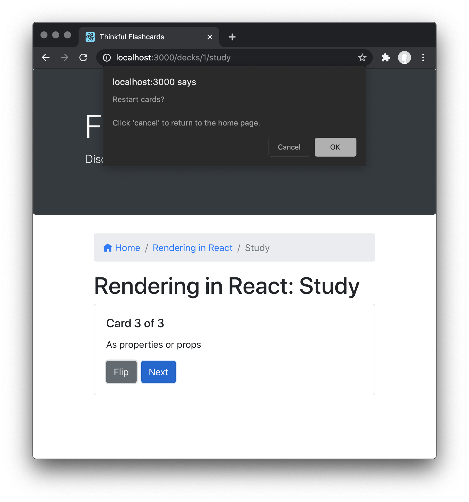
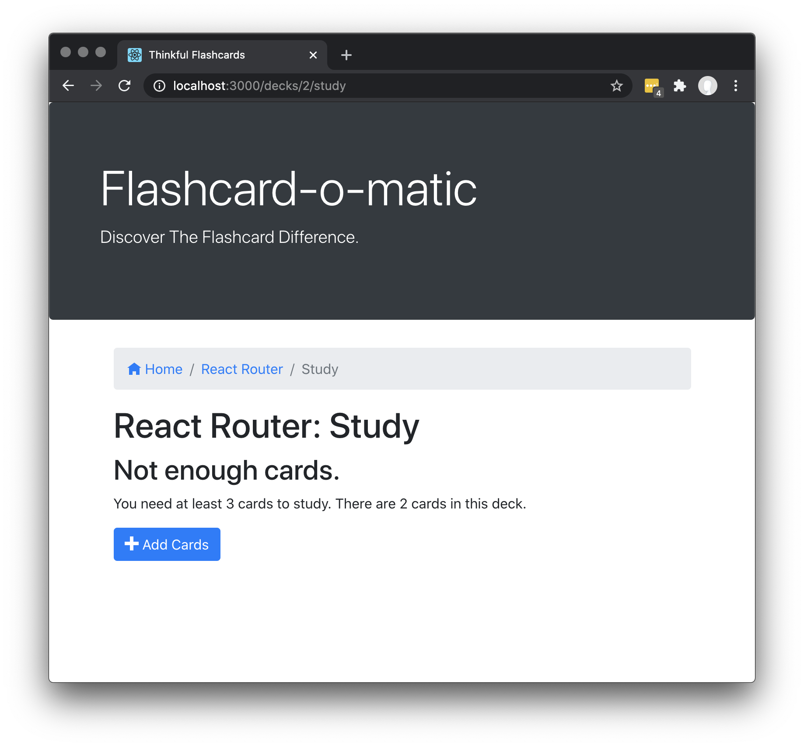
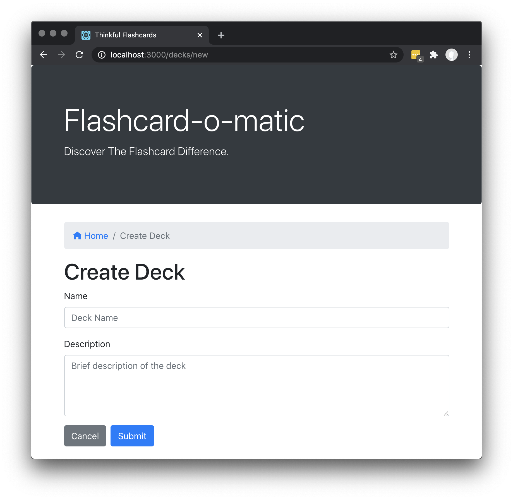
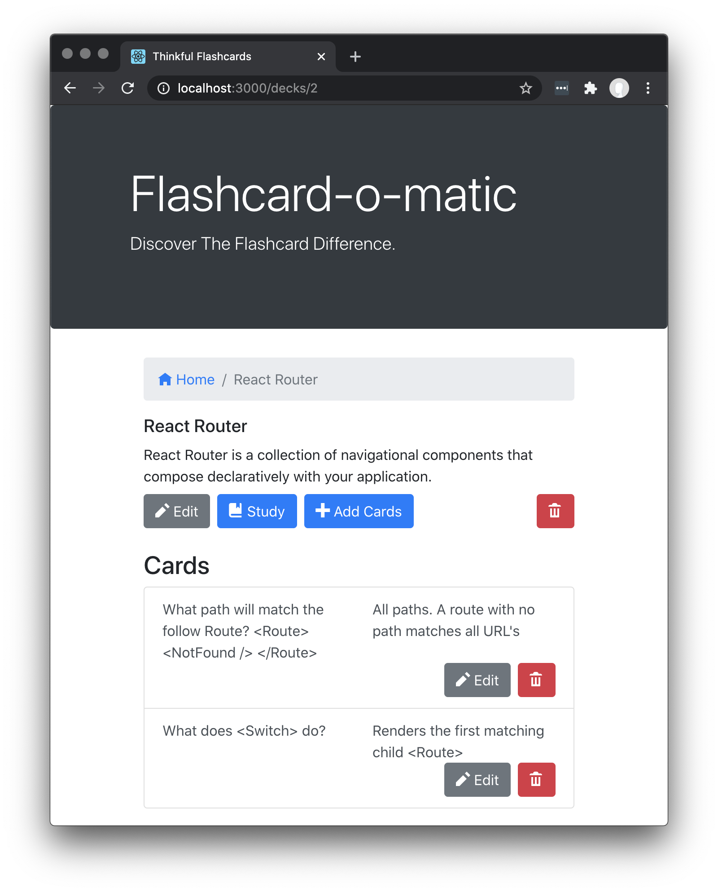
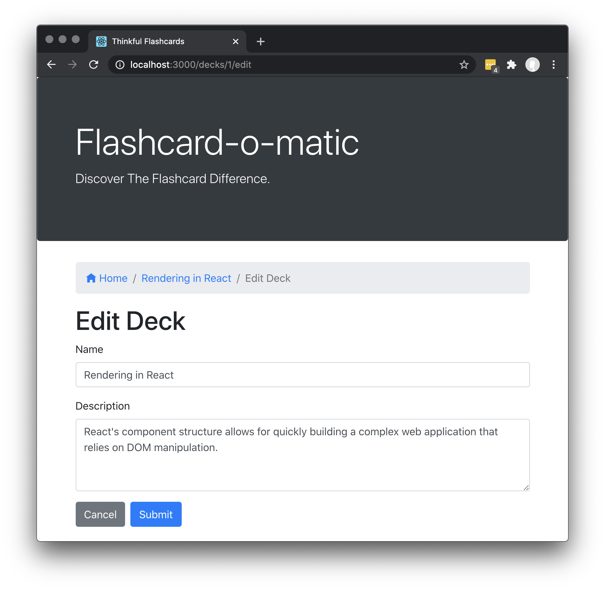
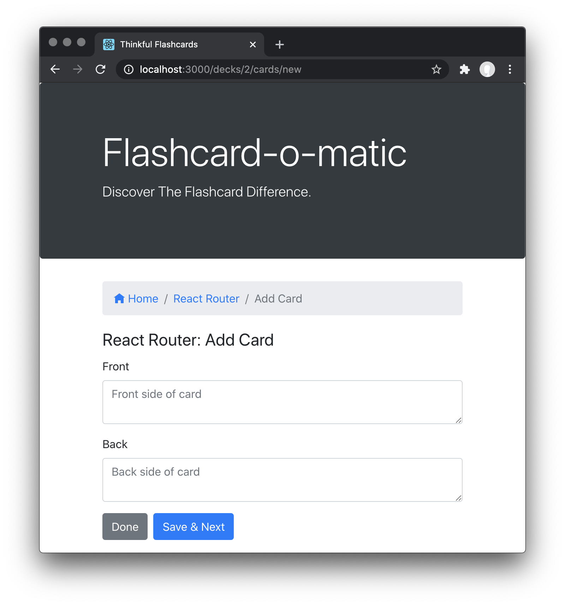
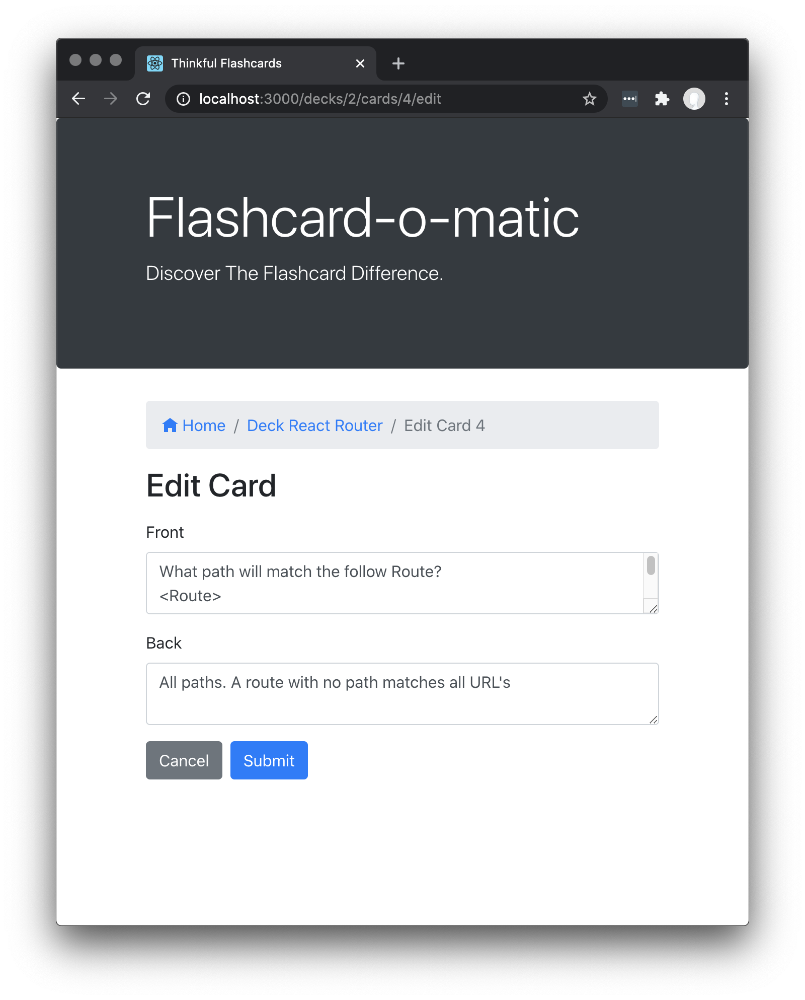

# Project: Flashcard App

A local school has decided to put together a flashcard application, _Flashcard_o_matic_, to help their students study online. Teachers will use this application to create decks of flashcards for the subjects they teach, and students will study the decks. The school needs you to build the application that the students and teachers will use.



This project is designed to test your ability to work with rendering and state management using React. Before taking on this module, you should be comfortable with the following:

- Installing packages via NPM.
- Running tests from the command line.
- Writing React function components.
- Creating routes, including nested routes, using React Router
- Using hooks like `useState()`, `useParams()`, and `useHistory()`.
- Debugging React code through console output and using the VSCode debugger.

## Project setup

Follow the instructions below to get this project up and running on your own machine:

- Fork and clone this repository.
- Run `npm install`.

To run the tests, you can run the following command:

```bash
npm test
```

Many tests wait for text to appear on the screen, so the tests will initially run slowly. It may take a minute or more for all the tests to run. The tests will speed up as the implementation nears completion.

You can run the application using the following command.

```bash
npm start
```

The `start` command will start two servers concurrently:

- An API server running on `http://localhost:5000`
- A React application running on `http://localhost:3000`

To stop the servers from running, you can press `Ctrl + C`.

## Instructions

You are tasked with building a number of different screens for the users of the flashcard app, as summarized below:

| Screen                      | Path                                | Description                                                                                                                                         |
| --------------------------- | ----------------------------------- | --------------------------------------------------------------------------------------------------------------------------------------------------- |
| [Home](#home)               | `/`                                 | shows a list of decks with options to create, study, view, or delete a deck                                                                         |
| [Study](#study)             | `/decks/:deckId/study`              | allows the user to study the cards from a specified deck                                                                                            |
| [Create Deck](#create-deck) | `/decks/new`                        | allows the user to create a new deck                                                                                                                |
| [Deck](#deck)               | `/decks/:deckId`                    | shows all of the information about a specified deck with options to edit or add cards to the deck, navigate to the study screen, or delete the deck |
| [Edit Deck](#edit-deck)     | `/decks/:deckId/edit`               | allows the user to modify information on an existing deck                                                                                           |
| [Add Card](#add-card)       | `/decks/:deckId/cards/new`          | allows the user to add a new card to an existing deck                                                                                               |
| [Edit Card](#edit-card)     | `/decks/:deckId/cards/:cardId/edit` | allows the user to modify information on an existing card                                                                                           |

All of the screens above will work on two common datasets. The datasets are related and at times you will need to work with both datasets to get the screens to work properly.

While working on these screens, you have both the tests and the screenshots below to act as a guide. You can create the screens in any order and are encouraged to organize your code however you like.

All of the files you need to edit are inside of the `public/src/` directory.

While working on this project, you _should:_

- Use well-named variables.
- Build small single responsibility components and functions.
- Display a "Not found" message if the user visits a URL that does not exist

While working on this project, you _should not:_

- Change the names of the API functions.
- Edit any of the files outside of the `public/src/` directory.

If you feel as though one of your solutions is working but something isn't showing up right on the site or in the tests, reach out for help.

## API

There are two datasets that are a part of this project: `decks` and `cards`.

You can view all the data inside of the `public/data/db.json` file. Each data set can be accessed via a named property in this file. The following is a partial listing of the data in `public/data/db.json`:

```json
{
  "decks": [
    {
      "id": 1,
      "name": "...",
      "description": "..."
    }
  ],
  "cards": [
    {
      "id": 1,
      "front": "...",
      "back": "...",
      "deckId": 1
    }
  ]
}
```

### Decks

Each deck is an object with the following shape:

```json
{
  "id": 1,
  "name": "Rendering in React",
  "description": "React's component structure allows for quickly building a complex web application that relies on DOM manipulation. "
}
```

A deck represents a collection of flashcards, or simply _cards_ .

### Cards

Each card is an object with the following shape:

```json
{
  "id": 1,
  "front": "Differentiate between Real DOM and Virtual DOM.",
  "back": "Virtual DOM updates are faster but do not directly update the HTML",
  "deckId": 1
}
```

Each card represents a flashcard with a _front_ , where the question is displayed, and a _back_, where the answer can be found. A card also contains the _deckId_, which matches the card to the deck that the card belongs to.

### Utility functions

There are several functions exported from [`src/utils/api/index.js` ](./src/utils/api/index.js)to help you work with the API server. Please read the documentation in the file for more information.

## Screens

You are tasked with creating the following screens that work with the above datasets.

### Home

The Home screen is the first page the user sees.


The Home screen has the following features:

- The path to this screen should be `/`.
- A "Create Deck" button is shown and clicking it brings the user to the [Create Deck screen](#create-deck).
- Existing decks are each shown with the deck name, the number of cards, and a “Study,” “View,” and “Delete” button.
  - Clicking the “Study” button brings the user to the Study screen.
  - Clicking the “Edit” button brings the user to the Edit Deck screen.
  - Clicking the “Delete” button shows a warning message before deleting the deck.

### Study

The Study screen is displayed at `/decks/:deckId/study`.



The Study screen has the following features:

- The path to this screen should include the _deckId_ (i.e., `/decks/:deckId/study`).
- The breadcrumb navigation (i.e., "Home/Rendering In React/Study") is shown on the screen.
- The deck title (i.e., "Study: Rendering in React" ) is shown on the screen.
- Cards are shown one at a time, front-side first.
- A button at the bottom of each card "flips" it to the other side.
- After flipping the card, the screen shows a [next button](#next-button) to continue to the next card.
- After the final card in the deck has been shown, a [message](#restart-prompt) is shown offering the user the opportunity to restart the deck.
  - If the user does not restart the deck, they should return to the home screen.
- Studying a deck with two or fewer cards should display a ["Not enough cards" message](#not-enough-cards) and a button to add cards to the deck.

#### Next button

The next button appears after the card is flipped.



#### Restart prompt

When all cards are finished, a message is shown and the user is offered the opportunity to restart the deck. If the user does not restart the deck, they return to the home screen.



#### Not enough cards

Studying a Deck with two or fewer cards should display a "Not enough cards" message and a button to add cards to the deck



### Create Deck

The [Home screen](#home) has a "Create Deck" button that brings the user to the Create Deck screen.



The Create Deck screen has the following features:

- The path to this screen should be `/decks/new`.
- The breadcrumb navigation (i.e., "Home/Create Deck") is shown on the screen.
- A form is shown with relevant fields for creating a new deck.
  - The description of the deck can be multiple lines of text.
- If the user clicks "submit", the user is taken to the [Deck screen](#deck).
- If the user clicks "cancel", the user is taken to the [Home screen](#home).

## Deck

The Deck screen displays all of the information about a deck.



The Deck screen has the following features:

- The path to this screen should include the _deckId_ (i.e., `/decks/:deckId`).
- The breadcrumb navigation (i.e., "Home/React Router") is shown on the screen.
- The screen includes the deck title (e.g., "React Router") and description (e.g., "React Router is a collection of navigational components that compose declaratively in your application").
- The screen includes "Edit", "Study", "Add Cards", and "Delete" buttons.

  | Button Clicked | Destination                                      |
  | -------------- | ------------------------------------------------ |
  | "Edit"         | [Edit Deck Screen](#edit-deck)                   |
  | "Study"        | [Study screen](#study)                           |
  | "Add Cards"    | [Add Card screen](#add-card)                     |
  | "Delete"       | Shows a warning message before deleting the deck |

- Each card in the deck is listed on the page under the "Cards" heading.
  - Each card shows a question and the answer to the question.
  - Each card has an “Edit” button that takes the user to the [Edit Card screen](#edit-card) when clicked.
  - Each card has a “Delete” button that allows that card to be deleted.

### Edit Deck

The Edit Deck screen allows the user to modify information on an existing deck.



The Edit Deck screen has the following features:

- The path to this screen should include the _deckId_(i.e., `/decks/:deckId/edit`).
- The breadcrumb navigation (i.e., "Home/Rendering in React/Edit Deck") is shown on the screen.
- It displays the same form as the [Create Deck screen](#create-deck), except it is pre-filled with information for the existing deck. The user can edit and update the form.
- If the user clicks "cancel", the user is taken to the [Deck screen](#deck).

### Add Card

The Add Card screen allows the user to add a new card to an existing deck.



The Add Card screen has the following features:

- The path to this screen should include the _deckId_ (i.e., `/decks/:deckId/cards/new`).
- The breadcrumb navigation (i.e., "Home/React Router/Add Card") is shown on the screen.
- The screen displays the "React Router: Add Card" deck title.
- A form is shown with the "front" and "back" fields for a new card. Both fields can accommodate multiple lines of text.
- If the user clicks "Save", a new card is created and associated with the relevant deck. Then the form is cleared and the process for adding a card is restarted.
- If the user clicks "Done", the user is taken to the [Deck screen](#deck).

### Edit Card

The Edit Card screen allows the user to modify information on an existing card.



The Edit Card screen has the following features:

- The path to this screen should include the _deckId_ and the _cardId_ (i.e., `/decks/:deckId/cards/:cardId/edit`).
- It displays the same form as the [Add Card screen](#add-card), except it is pre-filled with information for the existing card. It can be edited and updated.
- If the user clicks "Cancel", the user is taken to the [Deck screen](#deck).
