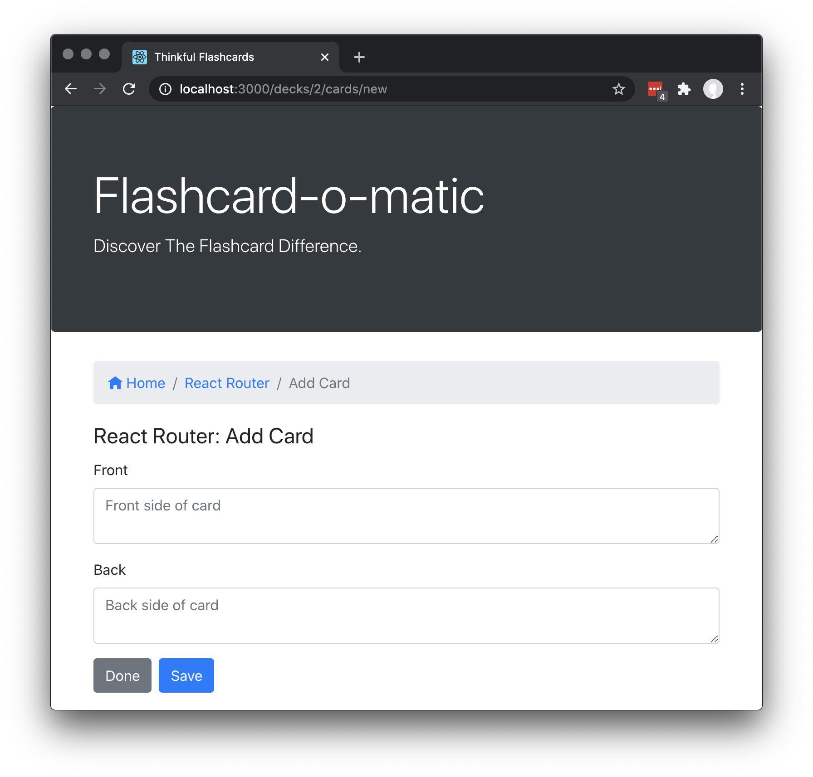

# Project: Flashcard App

A local school has decided to put together a flashcard application for their students study online. Teachers will use this application to create _decks_ of _flashcards_ for the subjects they teach, and students will _study_ the _decks_. The school needs you to build the application that the students and teachers will use.


This project is designed to test your ability to work with rendering and state management using React. Before taking on this module, you should be comfortable with the following:

- Installing packages via NPM.
- Running tests from the command line.
- Writing React function components.
- Creating routes, including nested routes, using React Router
- Using hooks like `useState()`, `useParams()`, and `useHistory()`.
- Debugging React code through console output and using the VSCode debugger.

## Project Setup

Follow the instructions below to get this project up and running on your own machine:

- Fork and clone this repository.
- Run `npm install`.

To run the tests, you can run the following command:

```bash
npm test
```

Many tests wait for text to appear on the screen, so the tests will initially run slowly. Perhaps a minute or more for all tests run.
The tests will speed up as the implementation nears completion.

You can run the application using the following command.

```bash
npm start
```

The `start` command will start two servers concurrently:

- An API server running on `http://localhost:5000`
- A React application server running on `http://localhost:5000`

To stop the servers from running, you can press `Ctrl + C`.

## Instructions

You are tasked with building a number of different screens for the users. All of the screens will work on two common datasets. The datasets are related and at times you will need to work with both datasets to get the screens to work properly.

While working on these screens, you have both the tests and the included screen shots to act as a guide. You can create the screens in any order and are encouraged to organize your code however you like.

All of the files you need to edit are inside of the `public/src/` directory.

While working on this project you _should:_

- Use well-named variables.
- Build small single responsibility components and functions.
- Display a "Not found" message if the user visits a URL that does not exist

While working on this project you _should not:_

- Change the names of the API functions.
- Edit any of the files outside of the `public/src/` directory.

If you feel as though one of your solutions is working but something isn't showing up right on the site or in the tests, reach out for help.

## API

There are two datasets that are a part of this project: `decks` and `cards`.

You can view all the data inside of the `public/data/db.json` file. Each data set is a named property in this file. The following is a partial listing of the data in `public/data/db.json`:

```json
{
  "decks": [
    {
      "id": 1,
      "name": "...",
      "description": "..."
    }
  ],
  "cards": [
    {
      "id": 1,
      "front": "...",
      "back": "...",
      "deckId": 1
    }
  ]
}
```

### Decks

Each Deck is an object with the following shape:

```json
{
  "id": 1,
  "name": "Rendering in React",
  "description": "React's component structure allows for quickly building a complex web application that relies on DOM manipulation. "
}
```

A Deck represents a collection of flashcards, or simply _cards_ .

### Cards

Each card is an object with the following shape:

```json
{
  "id": 1,
  "front": "Differentiate between Real DOM and Virtual DOM.",
  "back": "Virtual DOM updates are faster but do not directly update the HTML",
  "deckId": 1
}
```

Each card represents a flashcard, with a _front_ , the questions, and a _back_, the answer. A card also contains additional information. In particular:

- The deckId matches it up with a Deck. It represents the Deck to which this card is a member.

### Utility functions

There are several functions exported from [`src/utils/api/index.js` ](./src/utils/api/index.js)to help you work with the API server. Please read the documentation in the file for more information.

## Screens

You are tasked with writing the following screens that work with the above datasets.

### Home

The Home screen is first page the user sees.


The home screen has the following features:

- The path to this screen should be `/`
- A "Create Deck" button is shown and clicking brings the user to the New Deck screen.
- Existing decks are each shown with the deck name, the number of cards, and a “Study,” “View,” and “Delete” button.
- Clicking the “Study” button brings them to the Study screen.
- Clicking the “Edit” button brings them to the Edit Deck screen.
- Clicking the “Delete” button shows a warning message before deleting the deck.

### Study

The study screen is displayed at `/decks/:deckId/study`


The study screen has the following features:

- The path to this should include the deckId. i.e. `/decks/:deckId/study`
- The Deck information is shown on the screen.
- Cards are shown one at a time. Front side first.
- A button at the bottom of each card “flips” it to the other side.
- Then, after flipping, a button to continue to the next card is shown.
- When all cards are finished, a message is shown and the user is offered the opportunity to restart the deck. If the user does not restart the deck, they return to the home screen.
- Studying a Deck with two or fewer cards should display a "Not enough cards" message and a button to add cards to the deck

#### Next button

The next button appears after the card is flipped.


### Not enough cards

Studying a Deck with two or fewer cards should display a "Not enough cards" message and a button to add cards to the deck


## Restart prompt

When all cards are finished, a message is shown and the user is offered the opportunity to restart the deck. If the user does not restart the deck, they return to the home screen.


### Create Deck

The home screen has a "Create Deck" button that brings the user to the Create Deck screen.


The Create Deck screen has the following features:

- The path to this screen is `/decks/new`
- A form is shown with relevant fields for a new deck.
- The description of the deck can be multiple lines of text.
- After the deck is created, the user is brought to the Deck screen.
- If the user clicks cancel, they return to the home screen.

## Deck

The Deck screen displays all of the information about a deck.


The Deck screen has the following features:

- The path to this view should include the deck ID. i.e. `/decks/:deckId`
- The screen includes relevant information about the deck.
- The screen includes “Study,” “Edit,” "Add Cards," and “Delete” buttons.
- Clicking the “Study” button brings them to the Study screen.
- Clicking the “Edit” button brings them to the Edit Deck screen.
- Clicking the “Delete” button shows a warning message before deleting the deck.
- Clicking the “Add Cards” button brings them to the Add Card screen.
- Each card in the deck is listed somewhere on the page.
- Each card has an “Edit” button that allows that card to be edited.
- Each card has a “Delete” button that allows that card to be deleted.

### Edit Deck

The Edit Deck screen allows the user to modify information on an existing deck.


The Edit Deck screen has the following features:

- The path to this screen should include the deck ID. i.e. `/decks/:deckId/edit`
- The form from the Create Deck screen is filled in with the existing deck information. It can be edited and updated.
- If the user clicks cancel, they return to the deck screen.

### Add Card

The Add Card screen allows the user to add a new card to an existing deck.



The Add Card screen has the following features:

- The path to this screen should include the deck ID. i.e. `/decks/:deckId/cards/new`
- The view should include relevant information about the deck.
- A form is shown with relevant fields for a new card.
- All fields on a card can have multiple lines of text.
- On submit, a new card is created and associated with the relevant deck.
- Then, the form is cleared and the process can be restarted.
- If the user clicks the Done button, they return to the Deck screen.

### Edit Card

The Edit Card screen allows the user to modify information on an existing card.


The Edit Card screen has the following features:

- The path to this screen should include the deck ID and the card ID. i.e. `/decks/:deckId/cards/:cardId/edit`
- The form from the Add Card screen is filled in with the existing card information. It can be edited and updated.
- If the user clicks cancel, they return to the Deck screen.
